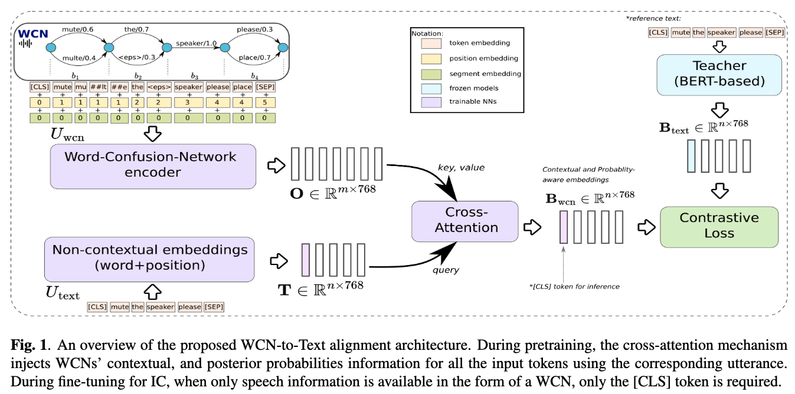

# Word-Confusion-Network-to-Text-Alignment

This repo contains all the needed files to replicate the WCN-to-Text experiments reported in our [ICASSP 2024 paper](https://ieeexplore.ieee.org/document/10445934).

## Model Architecture




## :books: Performance

Experimental results on the [SLURP](https://github.com/pswietojanski/slurp) test partition.

| **Model** | **XLSR-53 adaptation** | **Dev ACC (↑)** | **Dev F1 (↑)** | **Test ACC (↑)** | **Test F1 (↑)** |
|-----------|------------------------|-----------------|----------------|------------------|-----------------|
| **Text-based (conventional pipeline SLU)** | | | | | |
| *Oracle* | *NA* | *0.91* | *0.90* | *0.91* | *0.88* |
| 1-*best* | ✘ | 0.71 | 0.61 | 0.71 | 0.62 |
| 1-*best* | ✔ | 0.84 | 0.81 | 0.85 | 0.80 |
| **Acoustic-based (E2E approach)** | | | | | |
| S2B<sub>(LFB)</sub> | ✘ | 0.75 | 0.67 | 0.74 | 0.64 |
| S2B<sub>(XLSR53)</sub> | ✘ | 0.73 | 0.66 | 0.72 | 0.62 |
| S2B<sub>(XLSR53)</sub> | ✔ | **0.80** | **0.75** | **0.79** | **0.69** |
| **WCN-based** | | | | | |
| WCN2B<sub>(XLSR53)</sub> | ✘ | **0.70** | 0.61 | **0.69** | 0.62 |
| Villatoro et al.\* | ✘ | 0.68 | **0.67** | 0.68 | **0.68** |
| WCN2B<sub>(XLSR53)</sub> | ✔ | **0.80** | 0.72 | **0.81** | **0.75** |
| Villatoro et al.\* | ✔ | 0.78 | **0.77** | 0.79 | 0.79 |

## :pencil: Data preparation


Data need to be prepared following the standard [KALDI](https://kaldi-asr.org/doc/index.html) Data Preparation setup. See [here](https://kaldi-asr.org/doc/data_prep.html) for additional details. Some of these files yiu will need to create yourself. Below, we provide a brief explanation (extracted from Kaldi documentation) for your better understanding.

The file "text" contains the transcriptions of each utterance.

```
s5# head -3 data/train/text
test_2013_06_27BOS_DOT_flac_00000 hi welcome to the foxborough board of selectmen special meeting on june 27th
test_2013_06_27BOS_DOT_flac_00001 tonight's meetings was asked for by the kraft group to try and work out some insurance situations between the town and them
test_2013_06_27BOS_DOT_flac_00002 i'd like to welcome the attorneys in the kraft group to come up to the table in front of us please
```

The first element on each line is the utterance-id. The rest of the line is the transcription of each sentence.

Another important file is wav.scp. In the Switchboard example,

```
s5# head -3 data/train/wav.scp
test_2013_06_27BOS_DOT_flac_00000 ffmpeg -i peoples_speech/test/test/20130627BOS/20130627BOS/2013_06_27BOS_DOT_flac_00000.flac  -f wav - | sox -t wav - -r 16k -e signed-integer -b 16 --endian little -t wav -|
test_2013_06_27BOS_DOT_flac_00001 ffmpeg -i peoples_speech/test/test/20130627BOS/20130627BOS/2013_06_27BOS_DOT_flac_00001.flac  -f wav - | sox -t wav - -r 16k -e signed-integer -b 16 --endian little -t wav -|
test_2013_06_27BOS_DOT_flac_00002 ffmpeg -i peoples_speech/test/test/20130627BOS/20130627BOS/2013_06_27BOS_DOT_flac_00002.flac  -f wav - | sox -t wav - -r 16k -e signed-integer -b 16 --endian little -t wav -|
```

The format of this file is:

```
<recording-id> <extended-filename>
```

where the "extended-filename" may be an actual filename, or as in this case, a command that extracts a wav-format file. The pipe symbol on the end of the extended-filename specifies that it is to be interpreted as a pipe. The files in wav.scp must be single-channel (mono); if the underlying wav files have multiple channels, then a sox command must be used in the wav.scp to extract a particular channel.

Files ``text`` and ``wav.scp`` are important and necessary to run the pretraining using the LFB features. However, if the pretraining is run using the WCN representation, a file that must exist is ``PepSpeech_test_WCN.csv``.

```
test_2013_06_27BOS_DOT_flac_00590,['well:1:0.6595760370115035 <eps>:1:0.34042396298849653 it:2:0.6652342328238012 weather:2:0.33476576717619877 went:3:0.5915419808420588 twin:3:0.40845801915794117 ']
test_2013_06_27BOS_DOT_flac_00664,['find:1:0.5213103535968379 <eps>:1:0.47868964640316203 <eps>:2:0.8636403 fine:2:0.1363597 on:3:0.697732683408724 know:3:0.30226731659127604 my:4:1.0 lawn:5:0.5875882654999977 dog:5:0.25995914980602175 mom:5:0.15245258469398057 too:6:1.0 ']
test_2013_06_27BOS_DOT_flac_00671,['<eps>:1:0.8813307099059128 aim:1:0.11866929009408712 aimed:2:0.4119603803507703 okay:2:0.22627567414461824 aim:2:0.18608619351287364 assist:2:0.17567775199173777 ']
```

The format of this file is:

```
<recording-id>, ['hyp:pos:prob hyp:pos:prob hyp:pos:prob ...']
```
where ``hyp`` is the predicted word at position ``pos`` with probability ``prob``.

Note that all the above mentioned files will be necessary for the SLURP dataset as well. A few examples on how the data needs to be prepared are in the ``datasets`` folder. Full datasets are publicly available.


## :microscope: Running the Pre-training of a new model

Two configuration files are provided. The file ``config_pretrail.yaml`` should be used when running the pretraining modality.

```yaml
# Dataset used for pretraining. WCN are precomputed and strored locally
dataset_name: "PS"
train_set: "/dataset/peoplespeech/train/"
dev_set: "/dataset/peoplespeech//test/"

test_dataset_name: "SLURP"
test_set: "/slurp/testset_original_with_audioIDS"
test_set_audios: "/slurp/audios/"
mode: "pretrain"

#These will be used if the cross-modal SLU_Hybrid experiment is ON
text_dim: 768
#Acoustic features can be either "LFB" or "WCN"
acoustic_feats_type: "LFB"
acoustic_dim: 80

seed: 1
#Number of heads for the LISTENER Class
number_heads: 12
#Number of layer for the cross attention module
number_layers: 6
#Number of layers and attention heads for the WCN encoder
wcn_num_of_layers: 4
wcn_num_attn_heads: 4
#Learning rate
learning_rate: 0.0001
#dropout
dropout: 0.1
batch_size: 32
epochs: 200
steps: 600000
validate_after: 2000
checkpoint_after: 10000
save_after: 100000
save_model: True
log_after: 500
patience: 20

#TextEmbeddings and Acoustic embeddings
text_model: "bert-base-uncased"

#Pre-trained LFB or WCN model. Must match with acoustic_feats_type parameter
pretrained_model: "/tmp/Pretrained_Model.pt"

#GPU parameters for DPP
distributed: False
num_jobs: 1
gpu: '0'

runs_folder: "/tmp/Pretrain_Resutls"
monitor: ["f1"]
```

## :microscope: Running the fine-tuning for Intent Classification

Two configuration files are provided. The file ``config_train_slu.yaml`` should be used when doing the fine tuning for Intent Classification modality.

```yaml
#Experiment were performed on the SLURP dataset
dataset_name: "SLURP"
## SLURP files in XML format (hrc2 - files)
train_set: "/datasets/slurp/train"
dev_set: "/datasets/slurp/dev"
test_set: "/datasets/slurp/test"

## Here are the paths where the WCN will be searched
train_WCN_file: "/datasets/slurp/train/train_WCN.csv"
dev_WCN_file: "/datasets/slurp/dev/dev_WCN.csv"
test_WCN_file: "/datasets/slurp/test/test_WCN.csv"
test_set_audios: "/datasets/slurp/audios/"
# Running mode
# Two possible  values 'slu_ft' and "evaluate_slu_ft".
# slu_ft trains the model on SLURP dataset for performing Intent Clasificaiton
# evaluate_slu_ft evaluates the accuracy of the alignments of the model
mode: "slu_ft"

#Parameters for the textual embeddings dimensionality [BERT-768]
text_dim: 768

#Acoustic features can be either "LFB" or "WCN"
#The dimensionality for WCN is 768
#The dimensionality for LFB is 80
acoustic_feats_type: "LFB"
acoustic_dim: 80


seed: 1111
## For the LISTENER
number_heads: 12
# FOR THE CORSS_ATTENTION
number_layers: 6
#FOR THE WCN ENCODER
wcn_num_of_layers: 12
wcn_num_attn_heads: 12
learning_rate: 0.00002
#learning_rate: 0.00009
dropout: 0.2

#BATCHSIZE 32 if 1 GPU, 128 if 4 GPUS, 256 if 8 GPUs available
batch_size: 32
epochs: 200
steps: 200
validate_after: 100
checkpoint_after: 10
save_after: 100
save_model: True
log_after: 100
patience: 20

# TextEmbeddings and Acoustic embeddings
text_model: "bert-base-uncased"

# This valiable must point to the checkpoint of the pretrained model
pretrained_model: "/chkpt/Pretrained_Model.pt"

#GPU parameters for DPP
distributed: Flase
num_jobs: 1
gpu: '0'
#Output folder
runs_folder: "/tmp/IC_results"
monitor: ["f1"]
```
### How to run:

Depending on the modality you would like to try, you'll have to run as follows:

```
python3 main.py --config-name config_file_name
```

where ``config_file_name`` is one of the above options.

## Citation

```bibtex
@INPROCEEDINGS{10445934,
author={Villatoro-Tello, Esaú and Madikeri, Srikanth and Sharma, Bidisha and Khalil, Driss and Kumar, Shashi and Nigmatulina, Iuliia and Motlicek, Petr and Ganapathiraju, Aravind},
booktitle={ICASSP 2024 - 2024 IEEE International Conference on Acoustics, Speech and Signal Processing (ICASSP)},
title={Probability-Aware Word-Confusion-Network-To-Text Alignment Approach for Intent Classification},
year={2024},
pages={12617-12621},
keywords={Self-supervised learning;Signal processing;Encoding;Task analysis;Speech processing;Word-Confusion-Networks;Cross-modal Alignment;Knowledge Distillation;Intent Classification},
doi={10.1109/ICASSP48485.2024.10445934}}
```
